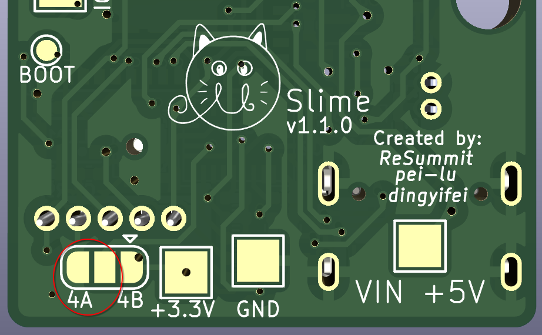

Micro form of SlimeVR trackers using BNO085 and ESP32-C6-MINI module, as small as possible

Limited to 1 sided PCB but utilizes two layer to achieve a maximal dimension of 25mm x 28mm (including the ESP32-C6-MINI module)

Also includes some test points if you wanna add idk RGB lights to it or something like that lol

## PCB Variants and Versions

Currently, v1.0.0 is the preferred PCB version and is listed in the releases. As a note, your red charge LED will always be on while the device is on. While this makes for a good indicator that your tracker is on, some may not like that the LED is always on. v1.1.0 fixes this but results in a long trace, change in pinout, and additional components needed.

**If you do not mind the always on LED, use v1.0.0 as it is less likely to result in RF issues. If you are bothered by the LED, use a 2k or higher SMD resistor value or use v1.1.0.**

On variants, there are currently three different types of main board PCBs and 2 types of supplementary modules. The first kind are listed as follows:
* uSlime_PCB: The default PCB with the BNO085 circuit on board. Contains the working BNO085 utilizing the internal crystal (of which there is little room for an external crystal)
* uSlime_PCB_Module: Similar to the default PCB; however, the BNO085 is replaced with a 5 pin I2C pin for attaching a uSlime_BNO085_Module on the back or front side of the PCB (in case you want to replace the IMU with a better one).
* uSlime_PCB_Pack: The default PCB but using pack resistors to attempt the reduction of part placements by quantity. **This has not been updated to v1.0.0 yet, DO NOT USE.**

For supplementary modules, the variants are as follows:
* uSlime_BNO085_Module: The default PCB for supplementary modules. In addition to the connectors that are compatible with the original SlimeVR trackers, they also have headers that you can use to connect it to something else instead if you decide not to use it for SlimeVR. This increases the versatility of the IMU for other projects. Due to the small size, a crystal could not be placed; however, one could be placed with a slightly larger PCB size.
* uSlime_BNO085: The other PCB for supplementary modules without the header pins. This is if you are sure that you are only using this for SlimeVR. You can technically still use this for other projects like with headers, but you will likely solder on wires.

## BOM and Pre-requisites

Bill of materials (BOMs) can be found in the `bom` folder within the respective PCB folder. These are generated on a by release basis, so they may not be up to date. It is highly recommended to generate the BOM using the "`Interactive Html Bom`" plugin found in typical KiCAD repository plugins.  
**Following the BOM placements using a BOM plugin to show where components are placed is mandatory, as there is no space for reference designators on the PCB.**

In addition to this, a hot plate, solder paste, and some needle tipped tweezers are also required. Flux may also be needed to fix any bridges that pop up on the board. Obviously, the components on the BOM are also required.

## Building the PCB

When ordering the PCB, choose to place the JLC PCB indicator as a preferred spot is placed on the PCB itself (if using JLCPCB for PCB production). You should also get a stencil to put solder paste on the PCB.

**Again, following the BOM placements using a BOM plugin to show where components are placed is mandatory, as there is no space for reference designators on the PCB.**
Place solder paste on the PCB. Afterwards, follow the Interactive HTML BOM to place all the capacitors, resistors, IMU, and MCU on the PCB. When ready, you can then place this on a hot plate. Please make sure that there are no bridges on the BNO085 or the USB C connector, as these can cause issues with functionality.

## Verification (MUST READ)

   

**Before testing and using, make sure to bridge the address bridge pads on the back of the PCB.** Verify that the board and the IMU functions by flashing the ESP32-C6 firmware first. If there is no address response, something may be wrong with the IMU (more likely to fail). Once you have verified that the IMU and MCU works, you can then solder the rest of the THT components such as the external IMU connector and battery connector.

## Firmware

The PCB currently uses a ESP32-C6 or equivalent MCU. Right now, there is a pull request to introduce this MCU into the SlimeVR ESP32 firmware located here:  
[SlimeVR ESP32-C6 Pull Request](https://github.com/SlimeVR/SlimeVR-Tracker-ESP/pull/327)

The Arduino core is technically updated but is still pending its full support to the ESP32-C6 line. Therefore, treat this as a beta firmware and subject to broken features or bugs.

## PCB Limitations

Due to the inherent nature of this PCB, there is a chance that this PCB may produce RF. We have not tested for RF emission but regardless, be careful if using this in RF restricted environments.

Also, the main PCB does not have USB voltage protection circuits! Unfortunately, we ran out of time for the release but it is plausible to add it...

In addition, due to the single-sided PCB layout, this is not technically as small as it could be. There have been countless videos that showcase the design possibly being smaller. Some resistor and SMD components can also be moved to the back due to the ease in soldering those components. However, those are slated for a v2.0.0 PCB and is not expected to be released within anytime this year.

Lastly, it is known that the charger SMD compoenent tends to heat up rather quickly while charging the battery. This shouldn't reach the melting point of solder but it is worth mentioning; perhaps a more efficient IC would be better here.

## Images:

   

## Footprints Used

Some footprints and symbols were used from other sources:
* ESP32-C6 Symbol: https://github.com/sparkfun/SparkFun_Thing_Plus_ESP32_C6
* ESP32-C6 Footprint: https://github.com/espressif/kicad-libraries
* BNO085 Footprint: Provided by Colin
* AP2112K-3.3TRG1 and MCP73831T-2ACI/OT Symbol / Footprint: From a class project :)
* MHT150RGBCT Footprint: Converted from EasyEDA
* JST ZH Pinout: Same as SlimeVR PCB :D
