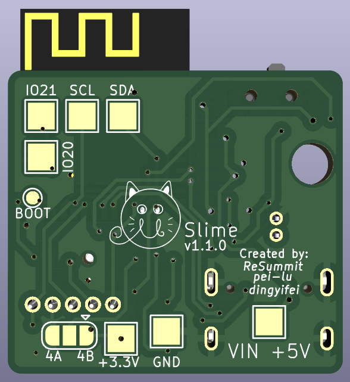

Micro form of SlimeVR trackers using BNO085 and ESP32-C6-MINI module, as small as possible

Limited to 1 sided PCB but utilizes two layer to achieve a maximal dimension of 25mm x 28mm (including the ESP32-C6-MINI module)

Also includes some test points if you wanna add idk RGB lights to it or something like that lol

## Images:

   

